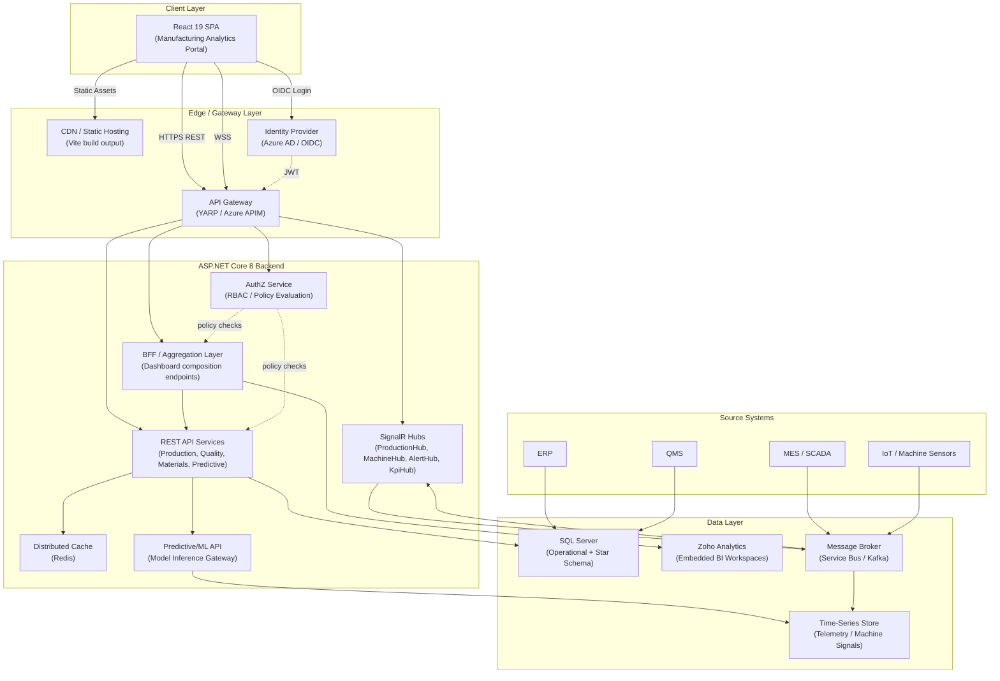
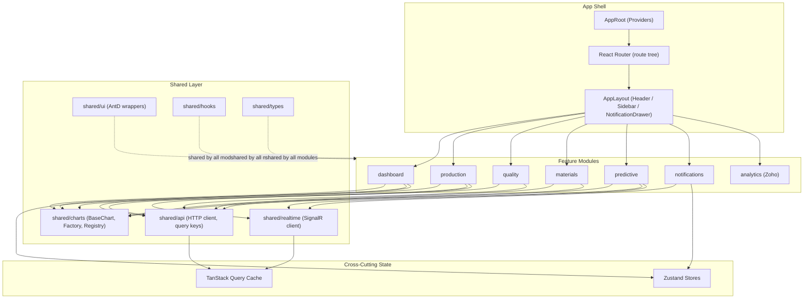
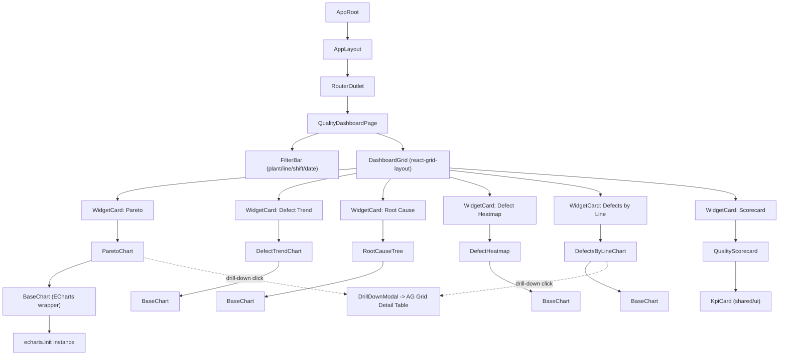
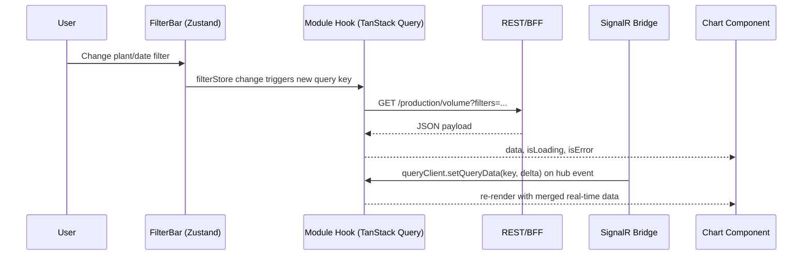
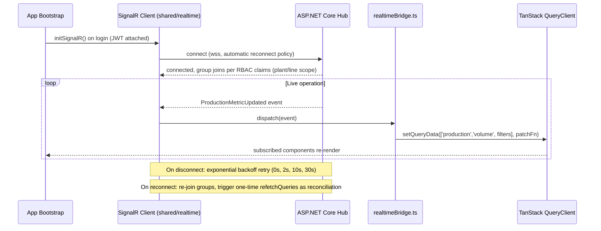
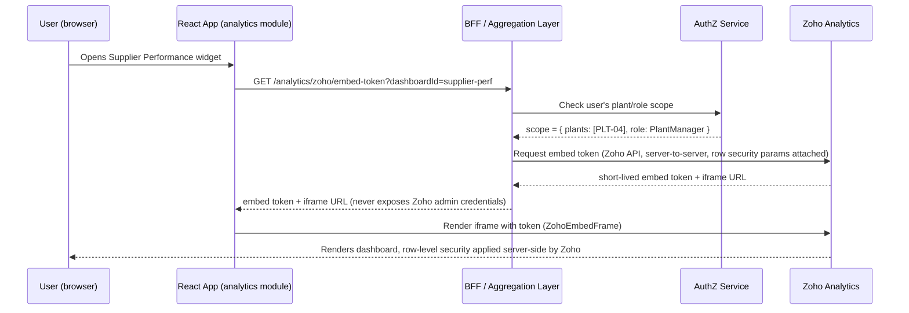
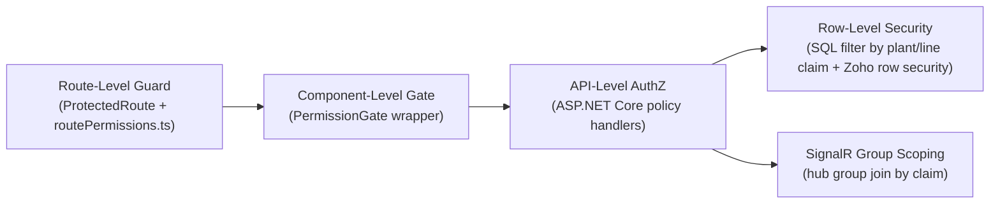
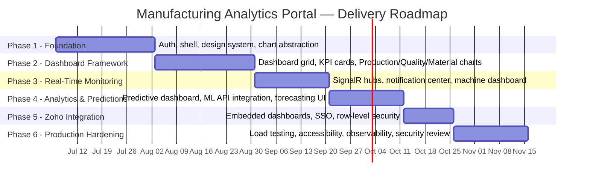

# Manufacturing Analytics Portal — Implementation Plan & Technical Architecture

**Document Type:** Enterprise Solution Architecture & Implementation Plan
**Audience:** Engineering Leadership, Platform Architects, Frontend/Backend Teams, DevOps, QA
**Scope:** React 19 / TypeScript / ASP.NET Core 8 manufacturing analytics platform with 25+ charts, real-time SignalR telemetry, predictive analytics, and hybrid Zoho Analytics embedding.

---

## Table of Contents

1. [Executive Summary](#1-executive-summary)
2. [Solution Architecture](#2-solution-architecture)
3. [Frontend Architecture](#3-frontend-architecture)
4. [Folder Structure](#4-folder-structure)
5. [Dashboard Breakdown](#5-dashboard-breakdown)
6. [Component Hierarchy](#6-component-hierarchy)
7. [State Management Plan](#7-state-management-plan)
8. [ECharts Strategy](#8-echarts-strategy)
9. [Real-Time Architecture](#9-real-time-architecture)
10. [Zoho Analytics Integration Strategy](#10-zoho-analytics-integration-strategy)
11. [Security & Access Control](#11-security--access-control)
12. [Performance Strategy & Non-Functional Requirements](#12-performance-strategy--non-functional-requirements)
13. [Phased Implementation Roadmap](#13-phased-implementation-roadmap)
14. [Risks and Mitigations](#14-risks-and-mitigations)
15. [Recommended Best Practices](#15-recommended-best-practices)

---

## 1. Executive Summary

This document defines the target architecture and a phased delivery plan for a Manufacturing Analytics Portal serving Plant Managers, Production Managers, Quality Teams, Operations Teams, Executives, and Data Analysts. The platform is not a single dashboard — it is a multi-tenant-capable, role-aware analytics product spanning six functional domains (Executive, Production, Quality, Materials, Predictive, Machine), backed by 25+ charts, sub-2-second real-time telemetry, and a hybrid analytics model that blends embedded Zoho Analytics dashboards with custom Apache ECharts visualizations.

The architecture is built around five core decisions that drive everything downstream:

- **A chart abstraction layer** (`BaseChart` + Chart Factory + Configuration Registry) so that 25+ charts are configured, not hand-coded, keeping bundle size and engineering effort linear rather than exponential as charts are added.
- **A dual-state model**: TanStack Query owns all server state (caching, refetching, background sync); Zustand owns UI/session state (filters, layout, notification queue); React local state owns ephemeral component state. This separation is the single biggest lever for avoiding the "props-drilling plus stale-cache" failure mode common in dashboard-heavy apps.
- **A SignalR hub-per-domain real-time model** that pushes deltas (not full payloads) into the TanStack Query cache via `queryClient.setQueryData`, unifying the "REST for first load, SignalR for live deltas" pattern across every dashboard.
- **A hybrid analytics model**: Zoho Analytics for ad-hoc/self-service/cross-functional BI where business users need pivoting and export; ECharts for prescriptive, real-time, and operationally embedded views where performance, custom interactivity, and SignalR streaming are required.
- **A federated module architecture** (`dashboard`, `production`, `quality`, `materials`, `predictive`, `notifications`, `analytics`, `shared`) with strict public-API boundaries (barrel exports only) so that 6+ feature teams can work in parallel without circular dependencies.

The roadmap is structured in six phases over roughly 24–28 weeks, moving from foundation (auth, shell, design system, chart abstraction) through dashboard framework, real-time monitoring, predictive/Zoho integration, and finally production hardening (load testing to 100+ concurrent users, accessibility, observability).

---

## 2. Solution Architecture

### 2.1 High-Level System Context



**Key architectural decisions embedded in this diagram:**

- A **BFF/Aggregation layer** sits in front of granular REST services so the frontend can request a single `GET /dashboards/executive` composite payload instead of 8–10 separate calls, directly supporting the < 3s initial load and < 1s dashboard-switch targets.
- **Redis distributed cache** sits between the REST layer and SQL Server for KPI aggregates that are expensive to compute (Pareto, OEE rollups) but only need to refresh on a defined cadence (see §12 caching strategy).
- A **message broker** decouples MES/IoT ingestion from the SignalR hubs, so a burst of machine telemetry doesn't directly back-pressure the API tier; the hubs subscribe to broker topics and fan out to connected clients.
- **Zoho Analytics is reached through the BFF**, not directly from the browser, so that SSO token exchange and row-level security mapping (plant → Zoho workspace) stay server-side and auditable.

### 2.2 Logical Domain Boundaries

| Domain | Primary Data Owner | Real-Time? | Visualization |
|---|---|---|---|
| Executive | BFF aggregation | Partial (KPI ticks) | ECharts + embedded Zoho |
| Production | MES → SQL | Yes (SignalR) | ECharts |
| Quality | QMS → SQL | Near-real-time | ECharts + Zoho (Pareto, RCA) |
| Materials | ERP/QMS → SQL | Daily/Batch | Zoho-first |
| Predictive | ML API → Time-series | Streaming | ECharts |
| Machine | IoT → Time-series | Yes (SignalR, sub-second) | ECharts |

---

## 3. Frontend Architecture

### 3.1 Frontend Layered Architecture



### 3.2 Module Dependency Rules

To keep 6+ teams shipping in parallel without circular imports or "big ball of mud" coupling, the architecture enforces (via ESLint `import/no-restricted-paths` + Nx/Turborepo project boundaries if a monorepo is adopted):

1. **Feature modules never import from other feature modules directly.** `quality` cannot import from `production`. Cross-module data needs are satisfied through `shared/api` query hooks or composite BFF endpoints, not direct imports.
2. **Feature modules may import freely from `shared/*`.**
3. **`shared/*` never imports from any feature module.** This is the boundary that keeps `shared` genuinely shared.
4. **`app/*` (shell, routing, providers) may import from feature modules**, but feature modules never import from `app/*` — this keeps modules portable and independently testable.
5. Each feature module exposes a single `index.ts` barrel; everything else inside the module is private to it. This is enforced with `no-restricted-imports` targeting deep paths like `features/quality/components/internal/*`.


---

## 4. Folder Structure

```
manufacturing-analytics-portal/
├── public/
│   └── assets/
├── src/
│   ├── app/
│   │   ├── App.tsx
│   │   ├── AppProviders.tsx              # QueryClientProvider, ZustandDevtools, AntD ConfigProvider, ThemeProvider
│   │   ├── routes/
│   │   │   ├── routeTree.tsx             # React Router route definitions, lazy-loaded
│   │   │   ├── ProtectedRoute.tsx        # RBAC-aware route guard
│   │   │   └── routePermissions.ts
│   │   ├── layout/
│   │   │   ├── AppLayout.tsx
│   │   │   ├── Header.tsx
│   │   │   ├── Sidebar.tsx
│   │   │   ├── NotificationBell.tsx
│   │   │   └── BreadcrumbBar.tsx
│   │   └── bootstrap/
│   │       ├── initSignalR.ts
│   │       ├── initSentry.ts             # observability/error tracking init
│   │       └── initMsal.ts               # Azure AD / OIDC init
│   │
│   ├── modules/
│   │   ├── dashboard/                    # Executive dashboard & dashboard shell/grid
│   │   │   ├── index.ts
│   │   │   ├── pages/
│   │   │   │   └── ExecutiveDashboardPage.tsx
│   │   │   ├── components/
│   │   │   │   ├── KpiCardGrid.tsx
│   │   │   │   ├── DashboardGrid.tsx     # react-grid-layout based widget grid
│   │   │   │   ├── AlertsSummaryWidget.tsx
│   │   │   │   └── ForecastSummaryWidget.tsx
│   │   │   ├── hooks/
│   │   │   │   └── useExecutiveDashboardData.ts
│   │   │   └── api/
│   │   │       └── dashboardApi.ts
│   │   │
│   │   ├── production/
│   │   │   ├── index.ts
│   │   │   ├── pages/
│   │   │   │   └── ProductionDashboardPage.tsx
│   │   │   ├── components/
│   │   │   │   ├── ProductionVolumeChart.tsx
│   │   │   │   ├── ThroughputChart.tsx
│   │   │   │   ├── UtilizationChart.tsx
│   │   │   │   └── DowntimeAnalysisChart.tsx
│   │   │   ├── hooks/
│   │   │   │   ├── useProductionMetrics.ts
│   │   │   │   └── useProductionRealtime.ts
│   │   │   └── api/
│   │   │       └── productionApi.ts
│   │   │
│   │   ├── quality/
│   │   │   ├── index.ts
│   │   │   ├── pages/
│   │   │   │   └── QualityDashboardPage.tsx
│   │   │   ├── components/
│   │   │   │   ├── ParetoChart.tsx
│   │   │   │   ├── DefectTrendChart.tsx
│   │   │   │   ├── RootCauseTree.tsx
│   │   │   │   ├── DefectHeatmap.tsx
│   │   │   │   ├── DefectsByLineChart.tsx
│   │   │   │   ├── DefectsByMachineChart.tsx
│   │   │   │   ├── DefectsByShiftChart.tsx
│   │   │   │   ├── DefectsByOperatorChart.tsx
│   │   │   │   └── QualityScorecard.tsx
│   │   │   ├── hooks/
│   │   │   │   └── useQualityMetrics.ts
│   │   │   └── api/
│   │   │       └── qualityApi.ts
│   │   │
│   │   ├── materials/
│   │   │   ├── index.ts
│   │   │   ├── pages/
│   │   │   │   └── MaterialDashboardPage.tsx
│   │   │   ├── components/
│   │   │   │   ├── MaterialQualityTrendChart.tsx
│   │   │   │   ├── SupplierPerformanceChart.tsx
│   │   │   │   ├── MaterialDefectCorrelationChart.tsx
│   │   │   │   ├── MaterialConsumptionChart.tsx
│   │   │   │   ├── MaterialWasteChart.tsx
│   │   │   │   └── MaterialCostAnalysisChart.tsx
│   │   │   ├── hooks/
│   │   │   │   └── useMaterialMetrics.ts
│   │   │   └── api/
│   │   │       └── materialsApi.ts
│   │   │
│   │   ├── predictive/
│   │   │   ├── index.ts
│   │   │   ├── pages/
│   │   │   │   └── PredictiveDashboardPage.tsx
│   │   │   ├── components/
│   │   │   │   ├── ActualVsPredictedChart.tsx
│   │   │   │   ├── ForecastConfidenceBandChart.tsx
│   │   │   │   ├── RiskIndicatorPanel.tsx
│   │   │   │   ├── AnomalyDetectionChart.tsx
│   │   │   │   ├── PredictedFailuresList.tsx
│   │   │   │   └── ModelResultsTable.tsx
│   │   │   ├── hooks/
│   │   │   │   ├── usePredictiveData.ts
│   │   │   │   └── usePredictiveRealtime.ts
│   │   │   └── api/
│   │   │       └── predictiveApi.ts
│   │   │
│   │   ├── machine/
│   │   │   ├── index.ts
│   │   │   ├── pages/
│   │   │   │   └── MachineDashboardPage.tsx
│   │   │   ├── components/
│   │   │   │   ├── MachineHealthGrid.tsx
│   │   │   │   ├── MachineStatusBoard.tsx
│   │   │   │   ├── RealtimeMachineGauges.tsx
│   │   │   │   └── PredictiveMaintenanceTimeline.tsx
│   │   │   ├── hooks/
│   │   │   │   └── useMachineRealtime.ts
│   │   │   └── api/
│   │   │       └── machineApi.ts
│   │   │
│   │   ├── notifications/
│   │   │   ├── index.ts
│   │   │   ├── components/
│   │   │   │   ├── NotificationDrawer.tsx
│   │   │   │   ├── ToastNotificationHost.tsx
│   │   │   │   ├── NotificationHistoryList.tsx
│   │   │   │   └── AcknowledgementModal.tsx
│   │   │   ├── hooks/
│   │   │   │   └── useNotificationStream.ts
│   │   │   ├── store/
│   │   │   │   └── notificationStore.ts   # Zustand
│   │   │   └── api/
│   │   │       └── notificationApi.ts
│   │   │
│   │   └── analytics/                     # Zoho integration module
│   │       ├── index.ts
│   │       ├── components/
│   │       │   ├── ZohoEmbedFrame.tsx
│   │       │   ├── ZohoDashboardSelector.tsx
│   │       │   └── ZohoErrorBoundary.tsx
│   │       ├── hooks/
│   │       │   └── useZohoEmbedToken.ts
│   │       └── api/
│   │           └── zohoApi.ts
│   │
│   ├── shared/
│   │   ├── charts/
│   │   │   ├── BaseChart.tsx              # generic ECharts wrapper (see §8)
│   │   │   ├── ChartFactory.tsx
│   │   │   ├── chartConfigRegistry.ts
│   │   │   ├── chartThemes.ts
│   │   │   ├── useChartResize.ts
│   │   │   ├── useChartDataTransform.ts
│   │   │   └── types.ts
│   │   ├── ui/
│   │   │   ├── KpiCard.tsx
│   │   │   ├── DataTable.tsx              # AG Grid Enterprise wrapper
│   │   │   ├── FilterBar.tsx
│   │   │   ├── DateRangePicker.tsx
│   │   │   ├── EmptyState.tsx
│   │   │   ├── LoadingSkeletons.tsx
│   │   │   └── PermissionGate.tsx
│   │   ├── hooks/
│   │   │   ├── usePermissions.ts
│   │   │   ├── useDebouncedValue.ts
│   │   │   ├── useWebWorker.ts
│   │   │   └── useVisibility.ts
│   │   ├── api/
│   │   │   ├── httpClient.ts              # axios/fetch instance, interceptors
│   │   │   ├── queryKeys.ts               # centralized query key factory
│   │   │   └── queryClient.ts
│   │   ├── realtime/
│   │   │   ├── signalRClient.ts           # connection factory, retry policy
│   │   │   ├── hubConnections.ts          # per-hub singleton connections
│   │   │   └── realtimeBridge.ts          # bridges hub events -> TanStack cache
│   │   ├── auth/
│   │   │   ├── AuthProvider.tsx
│   │   │   ├── usePermissions.ts
│   │   │   └── roles.ts
│   │   └── types/
│   │       ├── api.ts
│   │       └── domain.ts
│   │
│   ├── stores/                            # cross-module Zustand stores
│   │   ├── uiStore.ts                     # sidebar collapse, theme, active dashboard
│   │   ├── filterStore.ts                 # global plant/line/shift/date filters
│   │   └── notificationStore.ts           # re-exported from notifications module
│   │
│   ├── workers/
│   │   ├── paretoAggregation.worker.ts
│   │   └── timeSeriesDownsample.worker.ts
│   │
│   ├── styles/
│   │   ├── theme.ts                       # AntD ConfigProvider theme tokens
│   │   └── global.css
│   │
│   ├── main.tsx
│   └── vite-env.d.ts
│
├── tests/
│   ├── unit/
│   ├── integration/
│   └── e2e/                               # Playwright
├── .env.development
├── .env.production
├── vite.config.ts
├── tsconfig.json
└── package.json
```

**Notes on the structure:**

- Each feature module is **self-contained**: pages, components, hooks, and API calls live together, so a team can own `quality/` end-to-end without reaching into other folders.
- `shared/charts` is the single most reused folder in the codebase — it is what allows 25+ charts to be added as configuration rather than as bespoke components (detailed in §8).
- `shared/realtime/realtimeBridge.ts` is the integration point between SignalR and TanStack Query — this is where the "push updates directly into the query cache" pattern (§9) is implemented once, not per-module.

---

## 5. Dashboard Breakdown

### 5.1 Executive Dashboard (6 widgets)

| # | Widget | Chart Type | Engine | Real-Time |
|---|---|---|---|---|
| 1 | KPI Cards (OEE, Yield, Scrap, Throughput, Cost/Unit, Target Achievement) | Stat cards w/ sparkline | ECharts (sparkline) | Yes — KPI ticks |
| 2 | Production Trends | Multi-line time series | ECharts | Yes |
| 3 | Quality Trends | Multi-line time series | ECharts | Near-real-time |
| 4 | Alerts Summary | Stacked bar + list | ECharts + AntD List | Yes |
| 5 | Forecast Summary | Line w/ confidence band | ECharts | Batch (hourly) |
| 6 | Plant-Level Cross-Functional Drilldown | Pivot table / chart | **Embedded Zoho** | Batch |

### 5.2 Production Dashboard (4 charts)

| # | Chart | Type | Drill-Down |
|---|---|---|---|
| 1 | Production Volume | Bar (by line/shift) | Line → Machine → Shift |
| 2 | Throughput | Line (rate over time) | Time → Hourly buckets |
| 3 | Machine Utilization | Gauge grid / heatmap | Machine → Status history |
| 4 | Downtime Analysis | Stacked bar (by reason code) | Reason → Event log (AG Grid) |

### 5.3 Quality Dashboard (8 charts)

| # | Chart | Type | Notes |
|---|---|---|---|
| 1 | Pareto Analysis | Combo bar + cumulative line | Classic 80/20 defect Pareto |
| 2 | Defect Trend Analysis | Time series | By defect category |
| 3 | Root Cause Analysis | Tree / fishbone-style diagram | Custom ECharts tree |
| 4 | Defect Heatmap | Calendar/matrix heatmap | Line × Shift density |
| 5 | Defects by Line | Bar | |
| 6 | Defects by Machine | Bar | |
| 7 | Defects by Shift | Bar/radar | |
| 8 | Defects by Operator + Material | Bar / scorecard | Sensitive — RBAC gated (see §11) |

Quality Scorecards render as a composite of KPI cards + a **Zoho-embedded** scorecard for cross-period benchmarking where analysts need pivot/export.

### 5.4 Material Dashboard (6 charts)

| # | Chart | Type | Engine |
|---|---|---|---|
| 1 | Material Quality Trends | Time series | ECharts |
| 2 | Supplier Performance | Ranked bar / scorecard | **Zoho** (self-service comparison) |
| 3 | Material-Defect Correlation | Scatter / heatmap | ECharts |
| 4 | Material Consumption | Stacked area | ECharts |
| 5 | Material Waste | Bar | ECharts |
| 6 | Material Cost Analysis | Line + bar combo | **Zoho** (finance-adjacent, ad-hoc) |

### 5.5 Predictive Analytics Dashboard (6 charts)

| # | Chart | Type | Data Source |
|---|---|---|---|
| 1 | Actual vs Predicted (Defects) | Dual-line | ML API + SignalR delta |
| 2 | Predicted Machine Failures | Risk list + timeline | ML API |
| 3 | Predicted Downtime | Forecast line w/ band | ML API |
| 4 | Material Risk Scores | Heat-ranked table | ML API |
| 5 | Quality/Production Forecast | Line w/ confidence band | ML API |
| 6 | Anomaly Detection | Scatter w/ outlier markers | ML API + streaming |

### 5.6 Machine Dashboard (4 charts)

| # | Chart | Type | Real-Time |
|---|---|---|---|
| 1 | Machine Health Grid | Card grid w/ status color | Yes |
| 2 | Real-Time Status Board | Status matrix | Yes (sub-second) |
| 3 | Real-Time Gauges (temp, vibration, speed) | Gauge | Yes (sub-second, windowed) |
| 4 | Predictive Maintenance Timeline | Gantt-style timeline | Batch + ML overlay |

**Total custom ECharts visualizations: ~28.** Plus 4 embedded Zoho workspaces (Executive cross-functional, Quality Scorecards, Supplier Performance, Material Cost) — comfortably exceeding the "25+ charts" requirement while keeping ad-hoc/self-service analytics out of the custom-chart maintenance burden.

---

## 6. Component Hierarchy

### 6.1 Hierarchy Diagram (Quality Dashboard as representative example)



### 6.2 Component Taxonomy

| Layer | Examples | Responsibility |
|---|---|---|
| **Page Components** | `ExecutiveDashboardPage`, `QualityDashboardPage` | Compose layout, own page-level filter state, fetch composite data via module hooks |
| **Dashboard/Grid Components** | `DashboardGrid`, `KpiCardGrid` | Arrange widgets responsively (react-grid-layout), handle widget add/remove/resize persistence |
| **Widget/Chart Components** | `ParetoChart`, `ProductionVolumeChart` | Domain-specific: map domain data → generic chart config, handle drill-down click events |
| **Shared Chart Primitives** | `BaseChart`, `ChartFactory` | Engine-agnostic rendering, resize handling, theme application, loading/empty/error states |
| **Shared UI Components** | `KpiCard`, `DataTable`, `FilterBar`, `DateRangePicker` | Reusable AntD-based presentational components, no domain knowledge |
| **Layout Components** | `AppLayout`, `Header`, `Sidebar`, `NotificationDrawer` | App chrome, navigation, global notification surface |

**Design rule:** Domain chart components (e.g., `ParetoChart`) never call `echarts` directly — they only produce a `ChartConfig` object and pass it to `BaseChart`. This is what keeps the chart layer swappable (e.g., migrating a single chart type to a different rendering engine later touches one config, not 28 components).

---

## 7. State Management Plan

A dashboard-heavy enterprise app fails most often from conflating **server state** with **client/UI state**. This architecture draws that line explicitly.

### 7.1 Responsibility Matrix

| State Type | Owner | Examples |
|---|---|---|
| Server data (REST first-load) | **TanStack Query** | KPI aggregates, defect lists, material data, predictive model outputs |
| Server data (real-time deltas) | **TanStack Query** (updated via SignalR bridge) | Live machine status, live KPI ticks, live alert events |
| Cross-page UI/session state | **Zustand** | Active dashboard, global filter selection (plant/line/shift/date range), sidebar collapsed, notification queue/unread count, theme |
| Ephemeral component state | **React local state (`useState`/`useReducer`)** | Modal open/closed, hovered chart point, form input drafts, local sort/column state in a widget before "apply" |
| Derived/computed | **`useMemo` / selectors**, never duplicated into a store | Pareto cumulative %, chart series transforms |

### 7.2 TanStack Query Conventions

- **Centralized query key factory** (`shared/api/queryKeys.ts`) — every module imports key builders rather than hand-writing arrays, preventing cache collisions:
  ```ts
  export const queryKeys = {
    production: {
      volume: (filters: ProductionFilters) => ['production', 'volume', filters] as const,
      throughput: (filters: ProductionFilters) => ['production', 'throughput', filters] as const,
    },
    quality: {
      pareto: (filters: QualityFilters) => ['quality', 'pareto', filters] as const,
      defectsByLine: (filters: QualityFilters) => ['quality', 'defectsByLine', filters] as const,
    },
    // ...
  };
  ```
- **`staleTime` is tiered by data volatility**: machine telemetry `staleTime: 0` (always considered stale, relies on SignalR push rather than polling); daily aggregates (material cost, supplier performance) `staleTime: 15 * 60_000`; KPI cards `staleTime: 60_000` with a 60s background refetch as a safety net behind SignalR.
- **`select` option** is used to shape/derive data at the hook level (e.g., compute Pareto cumulative percentage) so chart components receive ready-to-render data and re-render only when the *derived* shape changes, not on every raw refetch.
- **Composite/aggregated endpoints** (BFF) are preferred over `useQueries` waterfalls for dashboard initial loads; `useQueries` is reserved for cases where widgets are independently added/removed by the user (customizable dashboard grid).

### 7.3 Zustand Store Design

```ts
// stores/filterStore.ts
interface FilterState {
  plantId: string | null;
  lineId: string | null;
  shift: ShiftCode | null;
  dateRange: [string, string];
  setFilters: (partial: Partial<FilterState>) => void;
  resetFilters: () => void;
}
```

- Stores are **sliced by concern** (`uiStore`, `filterStore`, `notificationStore`) rather than one monolithic store — this keeps selector-based re-renders narrow and keeps store files reviewable.
- Components subscribe with **fine-grained selectors** (`useFilterStore(s => s.plantId)`), never the whole store object, to avoid unnecessary re-renders across 25+ chart widgets.
- Zustand stores are the **single source of truth that TanStack Query keys depend on** — e.g., `filterStore.plantId` feeds directly into `queryKeys.production.volume(filters)`, so changing a global filter automatically invalidates/refetches the right queries without manual `invalidateQueries` calls scattered through the app.

### 7.4 Data Flow Summary



---

## 8. ECharts Strategy

With 25+ charts, the single highest-leverage architectural decision is treating charts as **data-driven configuration** rather than bespoke React components. This section defines the abstraction layer and the performance program that makes it scale.

### 8.1 Chart Abstraction Layer

#### 8.1.1 `BaseChart` Component

`BaseChart` is the only component in the codebase that imports `echarts` directly. It owns the imperative lifecycle (init, setOption, resize, dispose) and exposes a declarative React surface.

```tsx
// shared/charts/BaseChart.tsx
import { useEffect, useRef } from 'react';
import * as echarts from 'echarts/core';
import type { EChartsOption } from 'echarts';
import { useChartResize } from './useChartResize';

interface BaseChartProps {
  option: EChartsOption;
  loading?: boolean;
  height?: number | string;
  theme?: 'light' | 'dark' | 'manufacturing';
  onEvents?: Record<string, (params: unknown) => void>;
  notMerge?: boolean;        // false enables efficient incremental updates
  lazyUpdate?: boolean;      // true batches setOption calls in a frame
}

export function BaseChart({
  option, loading, height = 320, theme = 'manufacturing',
  onEvents, notMerge = false, lazyUpdate = true,
}: BaseChartProps) {
  const containerRef = useRef<HTMLDivElement>(null);
  const chartRef = useRef<echarts.ECharts | null>(null);

  useEffect(() => {
    if (!containerRef.current) return;
    chartRef.current = echarts.init(containerRef.current, theme, { renderer: 'canvas' });
    return () => chartRef.current?.dispose();
  }, [theme]);

  useEffect(() => {
    chartRef.current?.setOption(option, { notMerge, lazyUpdate });
  }, [option, notMerge, lazyUpdate]);

  useEffect(() => {
    chartRef.current?.showLoading?.(loading ? 'default' : undefined as never);
    if (!loading) chartRef.current?.hideLoading();
  }, [loading]);

  useEffect(() => {
    if (!chartRef.current || !onEvents) return;
    Object.entries(onEvents).forEach(([evt, handler]) => chartRef.current!.on(evt, handler));
    return () => Object.keys(onEvents).forEach(evt => chartRef.current?.off(evt));
  }, [onEvents]);

  useChartResize(containerRef, chartRef);

  return <div ref={containerRef} style={{ height, width: '100%' }} />;
}
```

Key decisions baked into `BaseChart`:

- **Tree-shaken core imports** (`echarts/core` + explicit chart/component registration in `shared/charts/echartsSetup.ts`) rather than the full `echarts` bundle — this alone typically cuts ECharts bundle weight by 60–70%.
- **`notMerge: false` + `lazyUpdate: true` by default** so real-time updates (§8.3) patch the existing option tree instead of fully re-rendering, which is essential once 6–10 charts are live-updating simultaneously on one dashboard.
- **Dispose-on-unmount** is mandatory — with 25+ charts mounted/unmounted across route changes, leaked `echarts` instances are the #1 cause of memory growth in long-running operator sessions.

#### 8.1.2 Chart Factory Pattern

```tsx
// shared/charts/ChartFactory.tsx
import { chartConfigRegistry } from './chartConfigRegistry';
import { BaseChart } from './BaseChart';

interface ChartFactoryProps<TData> {
  chartId: keyof typeof chartConfigRegistry;
  data: TData;
  filters?: Record<string, unknown>;
  onDrillDown?: (point: unknown) => void;
}

export function ChartFactory<TData>({ chartId, data, filters, onDrillDown }: ChartFactoryProps<TData>) {
  const definition = chartConfigRegistry[chartId];
  const option = definition.buildOption(data, filters);
  return (
    <BaseChart
      option={option}
      onEvents={onDrillDown ? { click: onDrillDown } : undefined}
      height={definition.defaultHeight}
    />
  );
}
```

#### 8.1.3 Chart Configuration Registry

```ts
// shared/charts/chartConfigRegistry.ts
export const chartConfigRegistry = {
  qualityPareto: {
    defaultHeight: 360,
    buildOption: (data: ParetoDatum[]) => ({
      tooltip: { trigger: 'axis' },
      xAxis: { type: 'category', data: data.map(d => d.defectCode) },
      yAxis: [{ type: 'value', name: 'Count' }, { type: 'value', name: 'Cumulative %', max: 100 }],
      series: [
        { type: 'bar', data: data.map(d => d.count), name: 'Defect Count' },
        { type: 'line', yAxisIndex: 1, data: data.map(d => d.cumulativePct), name: 'Cumulative %' },
      ],
    }),
  },
  productionVolume: {
    defaultHeight: 320,
    buildOption: (data: VolumeDatum[]) => ({ /* ... */ }),
  },
  // ...one entry per chart, 25+ total
} as const;
```

This registry is the **single place new charts are added**: a new chart is a new registry entry plus a `buildOption` function — no new imperative lifecycle code, no new resize/dispose handling, no new loading-state plumbing. This is what keeps marginal cost per chart roughly constant as the platform grows from 25 to 40+ charts over five years.

### 8.2 Performance Optimization

| Technique | Application |
|---|---|
| **Lazy Loading** | Every dashboard page is `React.lazy()` + `Suspense`-loaded at the route level; charts below the fold within a dashboard use `IntersectionObserver` (`useVisibility` hook) to defer `echarts.init` until scrolled into view. |
| **Code Splitting** | Route-based splitting (one chunk per dashboard) plus a separate vendor chunk for `echarts` and `ag-grid-enterprise`, since both are large and shared across many routes — Vite `manualChunks` configured accordingly. |
| **Virtualization** | AG Grid Enterprise's built-in row virtualization for all detail/drill-down tables (defect logs, downtime event logs can run into tens of thousands of rows); list-based widgets (notification history) use `react-window`. |
| **Memoization** | `buildOption` functions are wrapped in `useMemo` keyed on the raw data reference (which itself only changes via TanStack Query's referential-stability-on-no-change behavior); domain chart components are `React.memo`'d to avoid re-render cascades when sibling widgets update. |
| **Data Caching** | TanStack Query handles request-level caching (§7); a secondary in-memory LRU cache (`shared/charts/optionCache.ts`) memoizes computed `EChartsOption` objects for expensive transforms (e.g., Pareto cumulative calc on 10k+ rows) keyed by `(chartId, filtersHash)`. |
| **Web Workers** | CPU-heavy aggregation (Pareto cumulative %, time-series downsampling for dense machine telemetry) runs in dedicated workers (`workers/paretoAggregation.worker.ts`, `workers/timeSeriesDownsample.worker.ts`) via a `useWebWorker` hook, keeping the main thread free for 60fps chart interaction even while crunching tens of thousands of telemetry points. |

### 8.3 Real-Time Chart Updates

| Concern | Strategy |
|---|---|
| **Streaming Data** | SignalR hub pushes typed delta events (e.g., `MachineMetricUpdated { machineId, metric, value, ts }`); `realtimeBridge.ts` translates these into `queryClient.setQueryData` patches against the relevant TanStack Query cache entry — components never subscribe to SignalR directly. |
| **Incremental Updates** | `BaseChart` uses `setOption(option, { notMerge: false })` so ECharts patches only changed series/data points rather than rebuilding the whole chart — critical for gauges and line charts updating multiple times per second. |
| **Data Windowing** | Time-series charts (machine gauges, real-time throughput) maintain a **fixed-size sliding window** (e.g., last 300 points / last 5 minutes) in the query cache updater — old points are dropped as new ones arrive, bounding both memory and render cost regardless of session length. |
| **Chart Refresh Strategy** | Three-tier cadence: (1) sub-second raw push for machine gauges (throttled client-side to ~250ms via `requestAnimationFrame` batching to avoid overwhelming the renderer), (2) 2–5s batched updates for dashboard KPI ticks and production charts, (3) REST-poll fallback (60s) for any chart if the SignalR connection drops, with a visible "reconnecting" indicator on affected widgets. |

---

## 9. Real-Time Architecture

### 9.1 SignalR Hub Topology

Rather than a single monolithic hub, the platform uses **domain-scoped hubs** so clients only subscribe to the event volume relevant to dashboards they have open, and so hub-level authorization policies map cleanly to RBAC:

| Hub | Events | Typical Subscribers |
|---|---|---|
| `ProductionHub` | `ProductionMetricUpdated`, `ThroughputTick` | Production, Executive dashboards |
| `MachineHub` | `MachineStatusChanged`, `MachineMetricUpdated` (sub-second telemetry) | Machine dashboard, Predictive dashboard |
| `QualityHub` | `DefectEventRaised`, `QualityKpiUpdated` | Quality, Executive dashboards |
| `AlertHub` | `AlertRaised`, `AlertAcknowledged`, `AlertResolved` | Notification Center (global, always connected) |
| `KpiHub` | `KpiTick` (OEE, yield, scrap rolling values) | Executive dashboard |

### 9.2 Connection Lifecycle & Bridge Pattern



- **Group-based scoping**: on connect, the hub places the client into SignalR groups derived from their RBAC claims (e.g., `plant:PLT-04`, `line:L12`), so a Plant Manager only receives events relevant to their plant — this is both a performance optimization and a security control (defense in depth alongside REST-layer authorization).
- **Reconciliation on reconnect**: because deltas can be missed during a disconnect window, the bridge triggers a one-time `queryClient.refetchQueries` for affected keys immediately after reconnect, rather than trusting accumulated deltas indefinitely.
- **Backpressure handling**: `MachineHub` telemetry is throttled server-side (max emit rate per machine per client) and additionally windowed client-side (§8.3) so a noisy sensor cannot degrade UI responsiveness.

### 9.3 Notification Center

| Capability | Implementation |
|---|---|
| Severity tiers | `Critical`, `Warning`, `Informational` — each with distinct color token, icon, and default persistence (`Critical` notifications persist until acknowledged; `Informational` auto-dismiss after 8s) |
| Toast Notifications | AntD `notification` API driven by `AlertHub` events filtered to the user's current view scope; deduplicated by `alertId` to avoid repeat toasts on reconnect replay |
| Notification Drawer | Persistent slide-over (AntD `Drawer`) listing active + recent alerts, backed by `notificationStore` (Zustand) for unread count and `notificationApi` (TanStack Query, paginated) for history |
| Notification History | Server-persisted, queried via REST with infinite scroll (AG Grid or virtualized list), filterable by severity/domain/date |
| Acknowledgement Workflow | `AcknowledgementModal` posts `POST /alerts/{id}/acknowledge` with optional comment; optimistic update via TanStack Query `onMutate`, with rollback on failure; acknowledgement state also broadcasts via `AlertHub` so other connected supervisors see it live |

### 9.4 Real-Time SLAs Mapped to Architecture

| Requirement | How it's met |
|---|---|
| Real-time updates < 2 seconds | Direct hub push (no polling) + `notMerge:false` incremental chart patch avoids client-side recompute bottlenecks; measured end-to-end from DB write → hub broadcast → cache patch → paint |
| Graceful degradation | REST polling fallback (60s) automatically activates per-widget if SignalR connection state is `Disconnected` for > 10s, with a visible status badge |

---

## 10. Zoho Analytics Integration Strategy

### 10.1 Embedded Zoho Architecture



- **Secure Embedding**: the browser never talks to Zoho's auth endpoints directly. The BFF exchanges a server-held Zoho API credential plus the user's resolved RBAC scope for a short-lived, single-use embed token, which is the only thing handed to the client. Tokens are scoped to a specific dashboard and expire quickly (typically 5–10 minutes), with `ZohoEmbedFrame` requesting a fresh token on remount.
- **SSO**: Zoho Analytics is configured for SAML/OIDC federation against the same Azure AD tenant used for the portal, so plant/role group membership maps directly to Zoho's own user provisioning — avoiding a second identity silo.
- **Role-Based Access**: row-level security in Zoho (data row restrictions by Plant/Line) is configured to read from the same claims the AuthZ service evaluates for REST APIs, so a Plant Manager scoped to `PLT-04` sees the same data boundary in both the custom ECharts views and the embedded Zoho views — this consistency is enforced by mapping role definitions in `shared/auth/roles.ts` to Zoho's security tables via a one-time provisioning script, not duplicated logic in two places.

### 10.2 Hybrid Analytics Model — Decision Framework

| Use **Zoho Analytics** when... | Use **ECharts (custom)** when... |
|---|---|
| Business users need ad-hoc pivoting, filtering, or export to Excel/PDF | The view requires sub-2-second real-time SignalR updates |
| The view spans cross-functional data (finance + quality + materials) that's easier to model in Zoho's BI layer than in bespoke APIs | Custom drill-down/click-through interactivity tied to app navigation is required (e.g., click a Pareto bar → open a filtered AG Grid modal in-app) |
| Self-service report-building by Analysts is a goal (reduces engineering backlog for "just one more report" requests) | The chart must be embedded inside a tightly composed, branded dashboard layout with consistent design tokens |
| The refresh cadence is daily/batch (supplier performance, material cost) and doesn't need streaming | The data volume or transform (e.g., windowed time-series, ML overlays) needs client-side processing not natural to Zoho's report model |
| Long-term trend/benchmark analysis where Zoho's native comparison features add value | The chart needs to render predictive model outputs (confidence bands, anomaly markers) tightly coupled to custom ML API responses |

**Applied to this platform:** Executive cross-functional drilldown, Quality Scorecards, Supplier Performance, and Material Cost Analysis are Zoho-embedded (4 dashboards/widgets). Everything real-time, predictive, or operationally embedded (Production, Machine, Predictive dashboards, and the bulk of Quality's operational charts) is custom ECharts (~28 charts). This split is deliberate: it keeps engineering effort focused on the high-value, real-time, differentiated visualizations while letting Zoho absorb the long tail of ad-hoc/self-service reporting that would otherwise consume disproportionate frontend engineering time.

### 10.3 Data Flow & Caching for Zoho

- **Backend Integration**: Zoho workspaces are fed via Zoho's native data sync connectors against SQL Server/the data warehouse (scheduled sync, not real-time), decoupling Zoho refresh cadence from the operational database's transactional load.
- **API Gateway Pattern**: all Zoho embed-token requests route through the same API Gateway as REST/SignalR traffic, so rate limiting, logging, and auth enforcement are uniform across the whole platform rather than Zoho being a side-channel integration.
- **Caching Strategy**: embed tokens are not cached server-side (short-lived by design); the *dashboard metadata* (which Zoho dashboard IDs exist, their display names, which roles can see them) is cached in Redis with a 1-hour TTL, refreshed via a background job, since that metadata changes rarely.
- **Refresh Strategy**: Zoho-backed widgets show a "Data as of [sync timestamp]" indicator (read from Zoho's sync metadata API) so users understand they're viewing batch-refreshed data, distinct from the "live" badge shown on SignalR-backed ECharts widgets — this distinction is a UX requirement, not just a technical one, to avoid users assuming Zoho widgets are real-time.

---

## 11. Security & Access Control

### 11.1 Authentication

- **OIDC/Azure AD** as the identity provider; the SPA uses the authorization code flow with PKCE (MSAL.js), never storing long-lived tokens in `localStorage` — access tokens held in memory, refresh handled silently via MSAL's token cache, with a short-lived `httpOnly` refresh cookie pattern at the BFF for additional defense against XSS token theft.
- SignalR connections authenticate using the same JWT, attached as an access-token-provider callback on the hub connection builder, so hub group membership (§9.2) is derived from the same claims as REST calls — one identity, one claim set, enforced consistently across transport types.

### 11.2 Authorization — Role-Based Access Control

| Role | Dashboard Access | Notable Feature Permissions |
|---|---|---|
| **Admin** | All dashboards | User/role management, Zoho workspace provisioning, system configuration |
| **Plant Manager** | Executive (scoped to own plant), Production, Quality, Machine | Acknowledge alerts, export reports, no cross-plant data |
| **Quality Manager** | Quality, Materials, Predictive (defect-related) | Full quality drill-down including operator-level data, RCA editing |
| **Production Manager** | Production, Machine | Downtime event annotation, maintenance scheduling triggers |
| **Executive** | Executive, read-only views of all domain dashboards | No operator-level PII (defects-by-operator chart suppressed), cross-plant aggregate view |
| **Analyst** | All dashboards (read-only) + full Zoho self-service workspace access | Export, custom Zoho report creation; no acknowledgement/annotation rights |

### 11.3 Permission Enforcement — Defense in Depth



Permissions are enforced at **four independent layers** so that a frontend bug (e.g., a missing `PermissionGate`) cannot leak data — the API and database layers are the actual source of truth, with frontend checks existing purely for UX (hiding controls a user can't use) rather than as the security boundary.

- **Dashboard Permissions**: `routePermissions.ts` maps each route to required role(s); `ProtectedRoute` redirects unauthorized navigation attempts.
- **Feature Permissions**: granular flags (e.g., `quality.viewByOperator`, `alerts.acknowledge`) resolved once at login into a `usePermissions()` hook, consumed by `<PermissionGate requires="alerts.acknowledge">` wrappers around individual buttons/widgets — this is checked again server-side on the corresponding mutation endpoint.
- **Sensitive data minimization**: the "Defects by Operator" chart (operator-level performance data) is treated as sensitive — it's gated to Quality Manager/Admin only, and the underlying API additionally redacts operator identifiers for any role without the explicit `quality.viewByOperator` claim, even if a request somehow bypasses the UI gate.

---

## 12. Performance Strategy & Non-Functional Requirements

### 12.1 NFR Targets and How They're Met

| Requirement | Target | Architectural Mechanism |
|---|---|---|
| Initial load | < 3s | Route-level code splitting; BFF composite endpoints (1 round-trip per dashboard instead of 8–10); critical-path CSS inlined; AntD + ECharts loaded via shared vendor chunk cached across routes; skeleton loading states for perceived performance |
| Dashboard switching | < 1s | Pre-fetched route chunks (`React.lazy` + `<link rel="prefetch">` on hover/sidebar focus); TanStack Query cache persists across navigation so revisited dashboards render from cache while revalidating in background (`staleWhileRevalidate` pattern) |
| Real-time updates | < 2s | Direct SignalR push (no polling) + incremental ECharts `setOption` patching (§8.3); measured via synthetic end-to-end probes from data source to render |
| 25+ charts supported | — | Chart Factory + Registry (§8.1) keeps marginal engineering and bundle cost near-constant per chart; lazy chart mounting via `IntersectionObserver` |
| 100+ concurrent users | — | Stateless API tier behind the gateway (horizontal scale-out); SignalR backplane (Redis or Azure SignalR Service) to support multi-instance hub scale-out beyond a single server's in-memory connection limit; Redis cache absorbs read-heavy KPI aggregation load |
| Large manufacturing datasets | — | Server-side aggregation for chart-ready payloads (never ship raw row-level telemetry to the browser for charting); AG Grid Enterprise server-side row model for detail tables with millions of rows; time-series downsampling (LTTB or fixed-window averaging) applied server-side or in a Web Worker before charting |

### 12.2 Caching Strategy (Layered)

| Layer | What's Cached | TTL / Invalidation |
|---|---|---|
| CDN | Static JS/CSS/image assets | Immutable, content-hashed filenames |
| TanStack Query (client) | All REST responses | Tiered `staleTime` per §7.2; real-time-backed queries invalidated by SignalR push, not polling |
| In-memory option cache (client) | Computed `EChartsOption` objects for expensive transforms | LRU, invalidated on filter/data change |
| Redis (server) | KPI aggregates, Pareto/RCA computation results, Zoho dashboard metadata | 1–15 min TTL depending on volatility; explicit invalidation on relevant write events via message broker |
| SQL Server | Materialized/indexed views for star-schema rollups | Refreshed via ETL/scheduled jobs feeding the analytical schema separately from the transactional OLTP tables |

### 12.3 Build & Bundle Strategy

- Vite `manualChunks` separates: `vendor-react`, `vendor-antd`, `vendor-echarts`, `vendor-ag-grid`, and per-module chunks — this isolates the two heaviest dependencies (ECharts, AG Grid Enterprise) so a user who only opens the Executive dashboard never downloads the AG Grid Enterprise bundle.
- Bundle budgets enforced in CI (e.g., `vendor-echarts` < 250KB gzipped via tree-shaken `echarts/core` imports, route chunks < 100KB gzipped) with build failures on regression.
- Image/icon assets use AntD's icon set (tree-shaken per-icon imports) rather than a full icon font.

---

## 13. Phased Implementation Roadmap



### Phase 1 — Foundation (≈4 weeks)
- Repo scaffold (Vite + React 19 + TypeScript), CI/CD pipeline, lint/format/commit hooks.
- Auth integration (MSAL/OIDC), `AuthProvider`, `usePermissions`, route guards.
- App shell: `AppLayout`, `Header`, `Sidebar`, routing tree with lazy-loaded module stubs.
- **Chart abstraction layer**: `BaseChart`, `ChartFactory`, initial `chartConfigRegistry` with 2–3 reference charts.
- TanStack Query + Zustand setup: `queryClient`, `queryKeys` factory, `filterStore`, `uiStore`.
- Design system tokens in AntD `ConfigProvider` (manufacturing brand theme).
- Exit criteria: a working shell with login, navigation, and one fully real-data-driven chart end-to-end.

### Phase 2 — Dashboard Framework (≈4 weeks)
- Build out Production, Quality, Material dashboards and their full chart sets against the registry (≈18 charts).
- `DashboardGrid` (react-grid-layout) with persisted widget layout per user.
- `FilterBar`, global filter store wiring into query keys.
- AG Grid Enterprise integration for drill-down detail tables.
- Drill-down interaction pattern (`onDrillDown` → modal/detail table) standardized.
- Exit criteria: Production/Quality/Material dashboards fully functional against REST APIs (no real-time yet).

### Phase 3 — Real-Time Monitoring (≈3 weeks)
- SignalR hubs implementation (backend) + `shared/realtime` client layer (frontend).
- `realtimeBridge.ts` wiring hub events into TanStack Query cache for Production/Machine/Quality data.
- Notification Center: toast host, drawer, history list, acknowledgement workflow.
- Machine dashboard (real-time gauges, status board) with data windowing.
- Reconnection/backoff handling, "live" vs "stale" UI indicators.
- Exit criteria: real-time updates demonstrably land in-UI within the < 2s SLA under load test.

### Phase 4 — Analytics & Predictions (≈3 weeks)
- Predictive dashboard: actual-vs-predicted, forecast bands, risk scoring, anomaly detection.
- ML API integration contracts finalized with data science team.
- Web Worker offload for heavy client-side aggregation (Pareto, downsampling).
- Executive dashboard finalized (KPI cards, trends, alerts summary, forecast summary).
- Exit criteria: all custom ECharts dashboards (≈28 charts) complete and performance-budget compliant.

### Phase 5 — Zoho Integration (≈2 weeks)
- BFF embed-token exchange endpoint, AuthZ scope resolution.
- `ZohoEmbedFrame`, `ZohoDashboardSelector`, error/fallback states.
- SSO federation configuration, row-level security mapping validation.
- Embed the 4 hybrid dashboards (Executive cross-functional, Quality Scorecards, Supplier Performance, Material Cost).
- Exit criteria: Zoho-embedded views respect the same RBAC boundaries as native views, verified via cross-role test matrix.

### Phase 6 — Production Hardening (≈3 weeks)
- Load testing to 100+ concurrent users (k6/Artillery against REST + SignalR concurrently).
- Accessibility audit (WCAG 2.1 AA) across all dashboards, including chart alt-text/data-table fallback for screen readers.
- Observability: Sentry/Application Insights wiring, SignalR connection health dashboards, frontend performance RUM.
- Security review: penetration test, RBAC boundary test matrix, dependency audit.
- Bundle budget enforcement, final performance tuning against §12 NFR targets.
- Documentation, runbooks, on-call handoff.
- Exit criteria: all NFR targets met under representative load; go-live readiness sign-off.

**Total estimated duration: ~24–28 weeks** (assumes 2 parallel frontend feature squads from Phase 2 onward, plus a dedicated backend/platform squad for SignalR, BFF, and Zoho integration work).

---

## 14. Risks and Mitigations

| Risk | Likelihood | Impact | Mitigation |
|---|---|---|---|
| **Chart sprawl undermines the abstraction layer** — teams bypass `ChartFactory`/registry under deadline pressure, creating bespoke `echarts` calls scattered across components | Medium | High (erodes the core scalability assumption) | Lint rule banning direct `echarts` imports outside `shared/charts`; code review checklist item; registry-driven chart creation included in onboarding docs and Phase 1 reference implementation |
| **SignalR connection scale-out limits** under 100+ concurrent users with multiple server instances | Medium | High | Adopt Azure SignalR Service (or Redis backplane) from Phase 3, not retrofitted later; load test explicitly targets concurrent hub connections, not just REST throughput |
| **Real-time data volume overwhelms the browser** (dense machine telemetry across many open gauges) | Medium | Medium | Server-side throttling per machine/client; client-side data windowing (§8.3); Web Worker downsampling before charting |
| **RBAC drift between custom views and embedded Zoho views** (a role gains/loses access in one system but not the other) | Medium | High (data leakage or broken access) | Single source of truth for role definitions (`shared/auth/roles.ts`) with a provisioning script that syncs to Zoho's security tables; automated cross-role test matrix in CI for Phase 5 and regression-tested thereafter |
| **Zoho embed token exposure or misconfiguration** | Low | High | Tokens issued server-side only, short TTL, scoped per dashboard; never expose Zoho admin/API credentials to the client; periodic token-handling security review |
| **Predictive model output schema changes break the Predictive dashboard** | Medium | Medium | Versioned ML API contracts, schema validation at the API boundary (e.g., Zod/io-ts on the BFF or frontend edge), contract tests run against the ML API in CI |
| **Bundle bloat from AG Grid Enterprise + ECharts degrading initial load** | Medium | Medium | Mandatory route/vendor chunk splitting from Phase 1; CI-enforced bundle budgets (§12.3); lazy mount of below-fold charts |
| **Scope creep across 6 stakeholder personas** (Plant Manager, Production Manager, Quality, Operations, Executives, Analysts) diluting Phase 2 delivery | High | Medium | Persona-prioritized backlog with Plant/Production/Quality dashboards in Phase 2 and Executive/Predictive deferred to later phases where their dependencies (real-time, ML) are actually ready |
| **Stale or inconsistent data between SignalR-pushed deltas and REST first-load** after reconnects | Medium | Medium | Mandatory reconciliation refetch on reconnect (§9.2); visible "as of" timestamps on real-time widgets |
| **Five-year maintainability risk**: ECharts/AntD/TanStack Query major version upgrades over the platform's lifetime | Medium | Medium | Abstraction layers (`BaseChart`, `shared/ui` AntD wrappers) isolate third-party API surfaces so major version bumps touch a small number of files rather than 28 chart components individually |

---

## 15. Recommended Best Practices

**Architecture & code organization**
- Enforce module boundaries with lint rules (§3.2), not just documentation — boundaries that aren't enforced by tooling erode within two sprints on a multi-team project.
- Treat the chart registry (§8.1.3) as a product surface in its own right: document each entry, require a `buildOption` unit test asserting correct series shape for representative data, and review new chart additions against the registry pattern in PR review.
- Keep the BFF/aggregation layer's composite endpoints versioned independently from granular domain REST APIs, so dashboard-shape changes don't force breaking changes on services other consumers (e.g., a future mobile app) depend on.

**State & data**
- Never let a Zustand store hold server data "for convenience" — if it can be refetched from the API, it belongs in TanStack Query. This is the most common source of stale-UI bugs in dashboard apps.
- Centralize the query key factory (§7.2) from day one; retrofitting it after keys are scattered across 20+ modules is expensive.
- Default every new query to a deliberately chosen `staleTime` rather than the library default — force the question "how fresh does this actually need to be?" at creation time.

**Real-time**
- Build the reconnect-and-reconcile path (§9.2) before declaring any real-time feature "done" — the happy path (stable connection) is the easy 80%; the reconnect path is where production incidents happen.
- Throttle and window real-time data as close to the source as possible (server-side throttling before client-side windowing) so bandwidth and battery on operator tablets aren't wasted on data that will be dropped client-side anyway.

**Performance**
- Make bundle budgets and Web Vitals checks a CI gate, not a quarterly audit — performance regressions from a single careless `import { entire } from 'echarts'` are easy to introduce and hard to notice without automated enforcement.
- Favor server-side aggregation over shipping raw rows to the browser for any chart with > 1,000 underlying data points; this is both a performance and a security-minimization practice (less raw operational data in the browser's memory/devtools).

**Security**
- Treat frontend RBAC checks (`PermissionGate`, route guards) as UX affordances only — re-verify every permission server-side, including on SignalR hub group membership, as the actual security boundary (§11.3).
- Run the cross-role Zoho/native consistency test (§14) as an automated regression suite, not a one-time Phase 5 validation, since RBAC definitions will continue to evolve post-launch.

**Process**
- Stand up the Phase 1 reference dashboard (one fully wired chart, real-time-ready, RBAC-gated) before parallelizing teams across Phase 2 — it's the template every subsequent chart and dashboard copies, and catches abstraction-layer gaps cheaply, before they're replicated 25 times.
- Plan for a five-year horizon explicitly: review and budget time for major dependency upgrades (React, ECharts, AntD, .NET) on a roughly annual cadence rather than allowing the stack to drift until a forced, high-risk "big bang" migration becomes necessary.

---

*End of document. This plan should be reviewed jointly by Frontend Architecture, Backend/Platform, Data Science (predictive models), and the BI/Zoho administration team before Phase 1 kickoff, with a follow-up technical design review scheduled at the end of each phase.*
